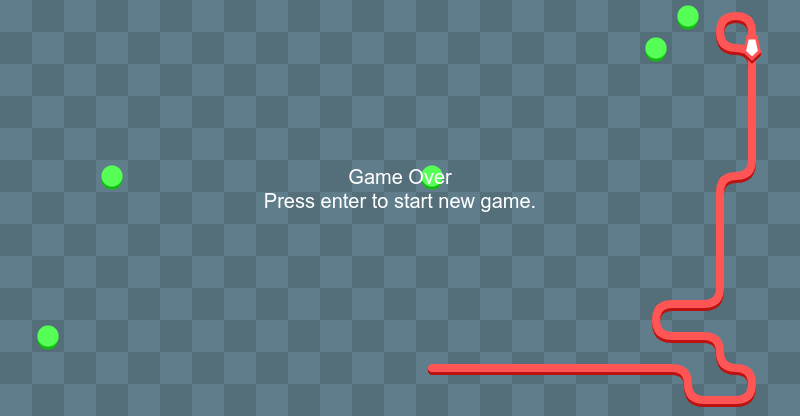
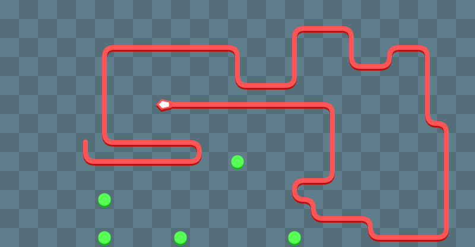
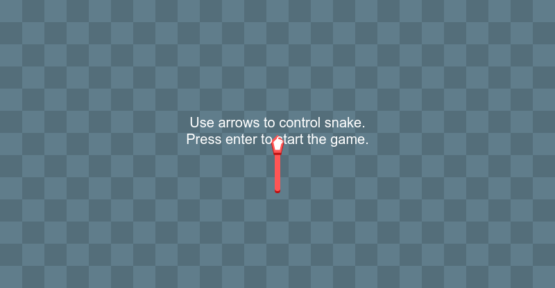
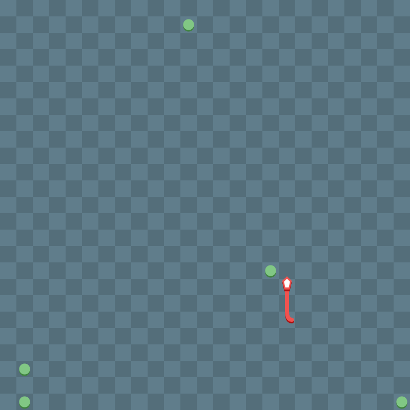

# Snake
Code in js folder has been transpiled from typescript code that you can find inside ts folder. 
Game is easly customizable by passing settings as second parameter while creating new Snake.Game instance. 
index.html shows example usage. 

# Some canvas screens:

Game grid is adjusting automatically to canvas resolution while creating new game instance.

